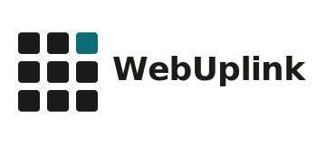

<picture>
  <source media="(prefers-color-scheme: dark)" srcset=".github/logo-dark.svg">
  <source media="(prefers-color-scheme: light)" srcset=".github/logo-light.svg">
  
</picture>

### MCP server for WebUplink

[](https://www.npmjs.com/package/@webuplink/mcp)
[](https://github.com/webuplink-dev/webuplink-mcp/actions)
[](LICENSE)

Give any MCP client the ability to browse and interact with the web via [WebUplink](https://webuplink.ai).

## Claude Desktop

Add to `claude_desktop_config.json`:

```json
{
  "mcpServers": {
    "webuplink": {
      "command": "npx",
      "args": ["-y", "@webuplink/mcp"],
      "env": {
        "WEBUPLINK_API_KEY": "wup_your_api_key"
      }
    }
  }
}
```

## Cursor

Add to `.cursor/mcp.json`:

```json
{
  "mcpServers": {
    "webuplink": {
      "command": "npx",
      "args": ["-y", "@webuplink/mcp"],
      "env": {
        "WEBUPLINK_API_KEY": "wup_your_api_key"
      }
    }
  }
}
```

That's it — your AI can now browse and interact with any website.

## Tools

### `browse`

Browse a web page or execute tools on a page.

| Parameter | Type | Description |
|-----------|------|-------------|
| `url` | string | URL to open a new browser session |
| `session_id` | string | Existing session ID to continue browsing |
| `tool` | string | Tool name to execute on the page |
| `params` | object | Parameters for the tool |
| `include_page_content` | boolean | Include detailed page content |

### `close_session`

Close a browser session to free resources.

| Parameter | Type | Description |
|-----------|------|-------------|
| `session_id` | string | Session ID to close |

## Environment Variables

| Variable | Required | Default | Description |
|----------|----------|---------|-------------|
| `WEBUPLINK_API_KEY` | ✅ | — | Your WebUplink API key |
| `WEBUPLINK_BASE_URL` | — | `https://api.webuplink.ai` | API base URL |

## HTTP Transport

For remote deployments:

```bash
WEBUPLINK_API_KEY=wup_... npx @webuplink/mcp --http
```

Listens on port 3001 (configurable via `PORT`), accepts MCP requests at `/mcp`.

## License

MIT
